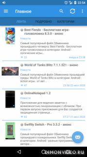

# dvclient
новый клиент для работы с dimonvideo.ru

Возможности:
- получение информации о материалах всех разделов сайта.
- поиск по всем разделам.
- авторизация на сайте, регистрация на сайте, просмотр своего профиля
- бесконечная загрузка (всех файлов до 2004г).
- форум (чтение, ответы, закладки, благодарности, цитирование).
- поиск по темам или по ответам.
- личка (все папки, удаление, чтение, ответы, push уведомления).
- список друзей (и отправка им сообщений).
- файлы (скачать, просмотр скрина, просмотр видео онлайн, оценка файлу, чтение и написание комментариев, загрузка файлов).
- много настроек.
- отсутствие фоновых служб, программа не висит в фоне.
- кеширование, небольшое потребление трафика.
- настраиваемый размер шрифта.
- экспорт и импорт настроек.
- выбор главного раздела.
- интеграция с DVGet / ADM.
- поддержка сайта (через встроенные покупки)
